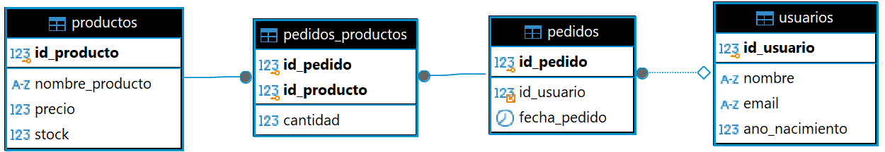
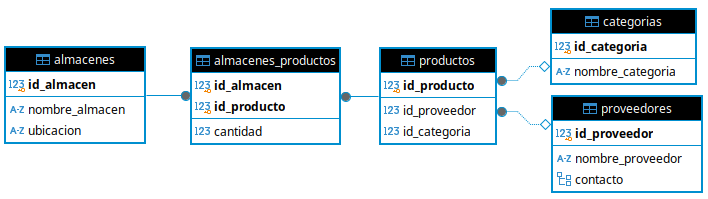

# Descripción del Proyecto

En este proyecto habrá que modelar dos bases de datos: una en MySQL y otra en PostgreSQL.

## Diagrama Relacional MySQL

La base de datos MySQL que habrá que modelar tiene el siguiente diagrama relacional:



En esta base de datos existen las siguientes relaciones:

- Una relación varios a varios entre **Productos** y **Pedidos**.
- Una relación varios a uno entre **Pedidos** y **Usuarios**.

## Diagrama Relacional PostgreSQL

La base de datos PostgreSQL que habrá que modelar tiene el siguiente diagrama relacional:



En esta base de datos existen las siguientes relaciones:

- Una relación varios a varios entre **almacenes** y **productos**.
- Una relación varios a uno entre **productos** y **categorias**.
- Una relación varios a uno entre **productos** y **proveedores**.

### Notas importantes

- En la tabla **proveedores**, el atributo **contacto** **representa un objeto** formado por los siguientes atributos: **nombre_contacto**, **nif**, **telefono** y **email**.
- **IMPORTANTE**: Las tablas **productos** de ambas bases de datos permiten establecer el enlace entre ambas. La información del producto se guardará principalmente en la base de datos MySQL, donde se almacenará junto con toda la información relacionada con los pedidos y los usuarios. En cuanto a la base de datos PostgreSQL, se almacenará la información del producto relacionada con su almacenamiento, categoría y proveedor.

### Datos de prueba

Los scripts SQL de ambas bases de datos deberán añadir datos a modo de ejemplo que permitan probar las consultas.

---

## Tareas a realizar

1. Diseñar una base de datos en MySQL y PostgreSQL que cumpla con los diagramas mostrados anteriormente.
2. Insertar datos ficticios en las bases de datos que permitan probar los apartados de la aplicación.
3. Desarrollar la aplicación Java usando JDBC para conectarte a las bases de datos.

### Funcionalidades a implementar en la aplicación

La aplicación debe permitir:

- Establecer las conexiones con la base de datos MySQL y PostgreSQL de la forma más eficiente que conozcas.
- Crear un menú que permita probar cada uno de los siguientes apartados:

#### Apartados a implementar:

1. Crear una nueva categoría (PostgreSQL)
2. Crear un nuevo proveedor (PostgreSQL)
3. Eliminar un proveedor (PostgreSQL)
4. Crear un nuevo usuario (MySQL)
5. Eliminar un usuario (MySQL)
6. Crear un nuevo producto (nombre, precio, stock, categoria, proveedor) (MySQL + PostgreSQL)
7. Eliminar un producto por su nombre (MySQL + PostgreSQL)
8. Listar los productos con bajo stock (menos de **X** unidades disponibles) (MySQL)
9. Obtener el total de pedidos realizados por cada usuario (MySQL)
10. Obtener la cantidad de productos almacenados por cada almacén (PostgreSQL)
11. Listar todos los productos con sus respectivas categorías y proveedores (PostgreSQL)
12. Obtener todos los usuarios que han comprado algún producto de una categoría dada (MySQL + PostgreSQL)

### Notas sobre las consultas

- Los apartados del 8 al 10 consisten en la realización de algún tipo de consulta. Salvo que el apartado indique lo contrario, el resultado de la consulta tendrá que obtenerse usando SQL o PostgreSQL. Java solo podrá usarse para realizar la iteración y mostrar los datos por pantalla, o para juntar las tablas **producto** de ambas bases de datos.

---

## Descripción Técnica

A continuación se detallan los aspectos técnicos que habrán que tener en cuenta a la hora de implementar los apartados anteriores:

### Crear una nueva categoría (PostgreSQL)

// Crear una nueva categoría (PostgreSQL)
 ```java
void crearCategoria(String nombreCategoria);

// Crear un nuevo proveedor (PostgreSQL)
void crearNuevoProveedor(String nombreProveedor, String nif, int telefono, String email);

// Eliminar un proveedor (PostgreSQL)
void eliminarProveedor(int id);

// Crear un nuevo usuario (MySQL)
void crearUsuario(String nombre, String email, int anho_nacimiento);

// Eliminar un usuario (MySQL)
void eliminarUsuario(int id);

// Crear nuevo producto (MySQL + PostgreSQL)
void crearProducto(String nombre, Double precio, int stock, String nombre_categoria, String nif);

// Eliminar un producto por su nombre (MySQL + PostgreSQL)
void eliminarProductoPorNombre(String nombre);

// Listar los productos con bajo stock (MySQL)
void listarProductosBajoStock(int stock);

// Obtener el total de pedidos realizados por cada usuario (MySQL)
void obtenerTotalPedidosUsuarios();

// Obtener la cantidad de productos almacenados por cada almacén (PostgreSQL)
void obtenerCantidadProductosEnCadaAlmacen();

// Listar todos los productos con sus respectivas categorías y proveedores (PostgreSQL)
void listarTodosProductosConCategoriaYProveedor();

// Obtener todos los usuarios que han comprado algún producto de una categoría dada (MySQL + PostgreSQL)
void obtenerUsuariosCompraronProductosCategoria(int idCategoria);

